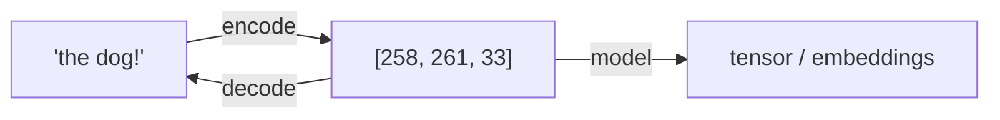
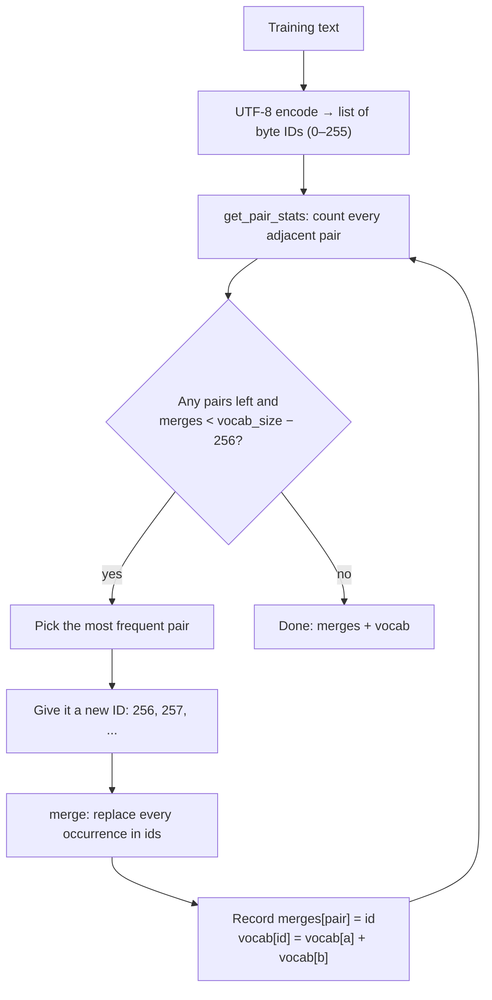
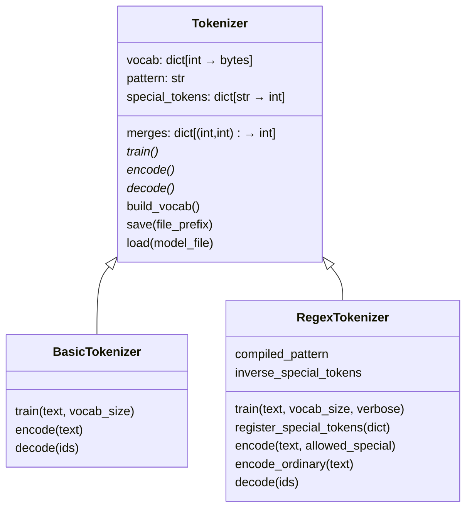
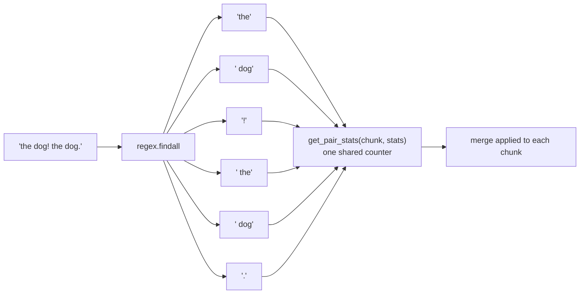

# bpe-tokenizer

A from-scratch **Byte Pair Encoding (BPE)** tokenizer in Python, the same family of algorithm behind GPT-2 and GPT-4. It has two tokenizers:

- **`BasicTokenizer`**: plain byte-level BPE over the raw text stream.
- **`RegexTokenizer`**: splits the text into chunks with the GPT-2 / GPT-4 regex before BPE, and supports special tokens such as `<|endoftext|>`.

> 📘 **New to tokenization?** This README explains *how the code works*. For the concepts (what bytes are, why BPE, why regex splitting helps), read **[LEARNING.md](LEARNING.md)** first.

---

## Table of contents

1. [What a tokenizer does](#what-a-tokenizer-does)
2. [How BPE works](#how-bpe-works)
3. [Project layout](#project-layout)
4. [Code walkthrough](#code-walkthrough)
5. [Basic vs. Regex tokenizer](#basic-vs-regex-tokenizer)
6. [Usage](#usage)
7. [Setup](#setup)
8. [Status / known issues](#status--known-issues)

---

## What a tokenizer does

A neural network can't read text, only numbers. A tokenizer converts text into a list of integer IDs and back again.



BPE starts from the **256 possible byte values**, so any string in any language can be represented. During training it learns **merges**: frequent pairs of tokens become a new, single token. That makes sequences shorter, and common words end up as one token.

---

## How BPE works

### Training: learn merges from a corpus



### Worked example: `"banana"`

These values come from running the code:

```text
text      :  b    a    n    a    n    a
bytes     : [98,  97, 110,  97, 110,  97]

get_pair_stats  →  {(98,97): 1, (97,110): 2, (110,97): 2}
                                  ▲ most frequent (first seen wins ties)

merge (97,110) → 256  ("an")
          : [98, 256, 256, 97]        b  an  an  a     6 tokens → 4
```

Keep repeating and `"banana"` can eventually become a single token.

### Encoding: apply the learned merges

Encoding text the model has never seen reuses the merges **in the order they were learned**. At each step, among all adjacent pairs in the sequence, the code merges the pair with the **lowest merge ID**, and it stops when no pair is in `merges`.

```text
"the dog!"  →  t h e ␣ d o g !
            →  th e ␣ d o g !          (116,104) → 257
            →  the ␣ d o g !           (257,101) → 258
            →  the ␣d o g !            (32,100)  → 259
            →  the ␣do g !             (259,111) → 260
            →  the ␣dog !              (260,103) → 261
result      →  [258, 261, 33]          ['the', ' dog', '!']
```

### Decoding

Decoding is a dictionary lookup followed by a join:

```text
[258, 261, 33] → [b'the', b' dog', b'!'] → b'the dog!' → "the dog!"
```

---

## Project layout

```text
bpe-tokenizer/
├── src/bpe_tokenizer/
│   ├── base.py        # helpers + abstract Tokenizer (vocab, save/load)
│   ├── basic.py       # BasicTokenizer: byte-level BPE
│   ├── regex_tok.py   # RegexTokenizer: GPT-2/4 split pattern + special tokens
│   └── __init__.py    # CLI entry point (placeholder)
├── LEARNING.md        # concept notes: start here to learn the theory
├── pyproject.toml
└── README.md
```



---

## Code walkthrough

### `base.py`: shared building blocks

| Function | What it does | Example |
|---|---|---|
| `get_pair_stats(ids, counts=None)` | Counts adjacent pairs. Pass an existing `counts` dict to add counts from several chunks into it. | `[1,2,1,2,3]` → `{(1,2):2, (2,1):1, (2,3):1}` |
| `merge(ids, pair, idx)` | Replaces every non-overlapping occurrence of `pair` with `idx`, scanning left to right. | `merge([1,2,3,1,2], (1,2), 99)` → `[99,3,99]` |
| `replace_control_characters(s)` | Escapes control characters (Unicode category `C*`) so tokens print safely. Used only for display. | `"dog\n"` → `"dog\\u000a"` |
| `render_token(token)` | Decodes bytes as UTF-8 (with `errors="replace"`), then escapes control characters. | `b'dog\n'` → `"dog\\u000a"` |

**`Tokenizer`** is the abstract base class. It holds the state every tokenizer shares:

```text
merges          {(116, 104): 257, (257, 101): 258, ...}   pair → new id
vocab           {0: b'\x00', ..., 257: b'th', 258: b'the'}  id → bytes
pattern         regex string (empty for BasicTokenizer)
special_tokens  {"<|endoftext|>": 100257}
```

`build_vocab()` rebuilds `vocab` from `merges`. It starts from the 256 raw bytes, then concatenates each merged pair's bytes. Merges are stored in creation order, so both parts of a pair are always already in `vocab`.

```text
vocab[256] = vocab[97]  + vocab[110] = b'a'  + b'n' = b'an'
vocab[258] = vocab[257] + vocab[101] = b'th' + b'e' = b'the'
```

### `basic.py`: `BasicTokenizer`

The simplest form of BPE. The whole text is treated as **one long byte stream**, and `train()` follows the training flowchart above exactly: count pairs → merge the most frequent → repeat `vocab_size − 256` times.

### `regex_tok.py`: `RegexTokenizer`

The approach used by GPT models. Before BPE runs, the text is split with a regex that separates letters, numbers, punctuation and whitespace:

```text
GPT4_SPLIT_PATTERN on  "Hello world!! I'm dog. dog! 12345"

['Hello', ' world', '!!', ' I', "'m", ' dog', '.', ' dog', '!', ' ', '123', '45']
                                       └─────┘      └─────┘
                         ' dog' is the same chunk in both places
```

Each chunk is encoded to bytes **separately**, so `ids` becomes a *list of lists*. Pairs are counted inside each chunk, and merges never cross a chunk boundary:



Other features:

- **`_encode_chunk(bytes)`** runs the "lowest merge ID first" encoding loop on one chunk.
- **`encode_ordinary(text)`** splits with the regex, encodes each chunk and concatenates the IDs. It ignores special tokens.
- **`encode(text, allowed_special=...)`** controls how special tokens are handled:

  | `allowed_special` | Behaviour |
  |---|---|
  | `"none_raise"` (default) | Raises an error if the text contains a registered special token |
  | `"none"` | Treats special tokens as ordinary text |
  | `"all"` | Maps every registered special token to its ID |
  | `{"<|endoftext|>"}` | Maps only the listed special tokens to their IDs |

  When special tokens are allowed, the text is first split on them with `re.split`. Each special token becomes one ID, and the text between them goes through `encode_ordinary`.

- **`decode(ids)`** looks each ID up in `vocab` first, then in `inverse_special_tokens`, and raises `ValueError` for an unknown ID.

---

## Basic vs. Regex tokenizer

```text
Corpus: "dog! dog. dog?"

BasicTokenizer (one stream)          RegexTokenizer (chunked)
──────────────────────────           ──────────────────────────
merges can cross into punctuation    chunks: 'dog' '!' ' dog' '.' ' dog' '?'
→ may learn  'dog!'  'dog.'  'g?'    → learns 'dog' / ' dog' once
→ wastes vocab slots on variants     → punctuation stays a separate token
```

| | `BasicTokenizer` | `RegexTokenizer` |
|---|---|---|
| Pre-splitting | none | GPT-4 pattern (default) or GPT-2 pattern |
| `ids` during training | `list[int]` | `list[list[int]]` |
| Merges cross word/punctuation boundaries | yes | no |
| Special tokens | no | yes |
| Used by | teaching / baseline | GPT-2, GPT-4-style models |

The concepts behind this comparison are explained in [LEARNING.md → "the problem with basic tokenization"](LEARNING.md).

---

## Usage

```python
from bpe_tokenizer.regex_tok import RegexTokenizer

text = "the dog! the dog. the dog? banana bandana " * 20

tok = RegexTokenizer()                 # GPT-4 split pattern by default
tok.train(text, vocab_size=262, verbose=True)
```

```text
merge 1/6: (97, 110) -> 256 (b'an') muncul 80 kali
merge 2/6: (116, 104) -> 257 (b'th') muncul 60 kali
merge 3/6: (257, 101) -> 258 (b'the') muncul 60 kali
merge 4/6: (32, 100) -> 259 (b' d') muncul 60 kali
merge 5/6: (259, 111) -> 260 (b' do') muncul 60 kali
merge 6/6: (260, 103) -> 261 (b' dog') muncul 60 kali
```

```python
ids = tok.encode("the dog!")
print(ids)                         # [258, 261, 33]
print([tok.vocab[i] for i in ids]) # [b'the', b' dog', b'!']
print(tok.decode(ids))             # the dog!

# special tokens
tok.register_special_tokens({"<|endoftext|>": 262})
tok.encode("the dog<|endoftext|>", allowed_special="all")  # [258, 261, 262]
```

To use the GPT-2 pattern instead:

```python
from bpe_tokenizer.regex_tok import RegexTokenizer, GPT2_SPLIT_PATTERN
tok = RegexTokenizer(pattern=GPT2_SPLIT_PATTERN)
```

---

## Setup

Requires Python ≥ 3.14 and [uv](https://docs.astral.sh/uv/).

```bash
git clone <this-repo> && cd bpe-tokenizer
uv sync                 # install dependencies (regex, tiktoken, torch, pytest)
uv run python           # then import as shown in Usage
```

The full environment setup notes are in [LEARNING.md](LEARNING.md).

---

## Status / known issues

This is a learning project and still in progress. `RegexTokenizer` training, encoding, decoding and special tokens all work, as shown above. These parts don't work yet:

- [ ] **`BasicTokenizer.encode`** is broken: `pair` is used before it is assigned, and the merge step sits outside the `while` loop. `train` and `decode` work.
- [ ] **`Tokenizer.save`** writes lines without `\n` separators, and its byte-table lines don't match the format `load` expects.
- [ ] **`Tokenizer.load`** calls `self._build_vocab()`, but the method is named `build_vocab()`.
- [ ] No tests yet (`pytest` is installed). A good first test is comparing against `tiktoken`.
- [ ] `bpe-tokenizer` CLI entry point (`__init__.py:main`) is a placeholder.

---

## Further reading

- **[LEARNING.md](LEARNING.md)**: concept notes for this project
- Sennrich et al., 2016: *Neural Machine Translation of Rare Words with Subword Units* (the original BPE-for-NLP paper)
- OpenAI [`tiktoken`](https://github.com/openai/tiktoken): the production BPE tokenizer this design mirrors
